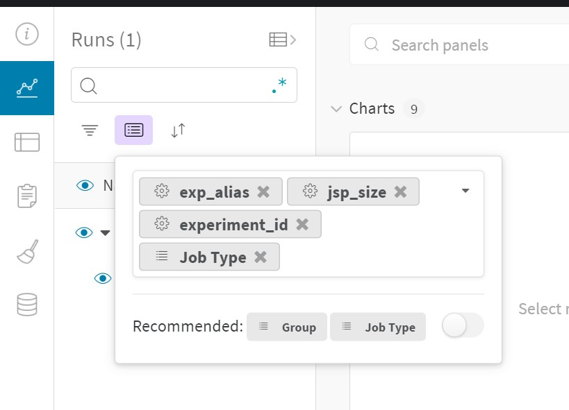
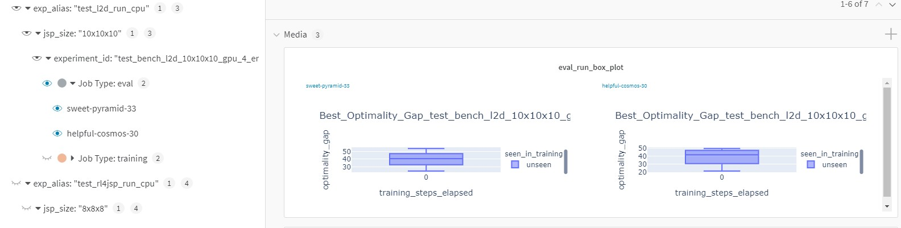

# About
This repository contains the source code of the experimentation framework covering RL 
applications for order release and sequencing in job shop production environments. Provided solutions 
can serve as a benchmark and starting point for future research in this area. 

The given implementation contains 
isolated solutions covering:
1) Flexible training and evaluation workflow suitable for different scheduling applications in production 
scheduling.
2) Flexible and fast discrete event simulation for job shop applications tailored for the use with RL
3) Multiple solutions for reward design, state-space representation and action spaces
4) A structured to reproduce existing and configure new experiments using dedicated configuration files
5) Several sets of job shop problems (JSPs) of various sizes

This repository augments the paper "Reinforcement Learning in Manufacturing 
Control: Baselines, challenges and ways forward." by Samsonov et al., published in the Journal of Engineering 
Applications of Artificial Intelligence. In case you find this repository usefull for you research, please cite it as 
follows: 

```
@article{Samsonov2022,
title = {Reinforcement Learning in Manufacturing Control: Baselines, challenges and ways forward},
journal = {Engineering Applications of Artificial Intelligence},
year = {2022},
doi = {https://doi.org/10.1016/j.engappai.2022.104868},
author = {Vladimir Samsonov and Karim Ben Hicham and Tobias Meisen},
}
```

# How to get the results:
1) Checkout this git repository to you local machine and navigate navigate into the root directory.
## Setup Weights&Biases acount
2) All results and visualizations are logged to the [Weights&Biases](https://wandb.ai/site) experiment tracking platform. 
Please have a look at the description here: [Weights&Biases Quick Start](https://docs.wandb.ai/quickstart)
3) After having created a Weights&Biases account please update the wandb_variables.env in the root directory with your 
   WANDB API KEY and your WANDB entity. 

To reproduce the results you can use any kubernetes cluster or run it using docker-compose.
## Option 1 [preffered]: Run experiments using Kubernetes cluster
I strongly recommend running the experiments using a kubernets cluster because of the easiness of resource 
   management and scalability. In case you don't have an access to a dedicated kubernetes cluster you still can run a 
   kubernetes cluster locally. Please refer to [minicube](https://minikube.sigs.k8s.io/docs/start/) documentation.

4) Create a secret containing Weights&Biases credentials by doing following:
   1) modify the file Data\k8s_jobs\secret_wandb.yaml accordingly with your Weights&Biases credentials
   2) run the following command:
   ```bash
    kubectl apply -f Data\k8s_jobs\secret_wandb.yaml
   ```
5) run the following command to submit all experiments from the paper to the kubernetes cluster:
   ```bash
    kubectl create -f .\Data\k8s_jobs\generated_jobs\
   ```
   or pick a particular kubernetes job:
   ```bash
    kubectl create -f .\Data\k8s_jobs\generated_jobs\$experiment_name.yml$
      ```
   e.g.:
   ```bash
    kubectl create -f .\Data\k8s_jobs\generated_jobs\job-r2_70_makespan_6x6x6_2_15x15x15_900jsp_eps02_shuffle_explr_incent_01_6x6x6_0i-1292.yaml
   ```
   The experimental runs will be built and executed automatically.

## Option 2: Run experiments using Docker Compose
Alternatively, you can choose to run experiments in docker containers using docker compose files in the root directory. 
This is less advantagous way compared to the kubernetes with several problem related to allocation of resources and queuing. 
To use docker compose followign steps should be followed:
4) To reproduce the results ensure Docker and docker-composed are installed as described here: 
   [Docker Installation Instructions](https://docs.docker.com/get-docker/) and
   [Docker Compose Installation Instructions](https://docs.docker.com/compose/install/)
5) Add your Weights&Biases credentials to wandb_variables.env file from the root directory.   
6) When everything is set navigate to the project root directory, pick one experiment (All experiments are containerized 
and grouped in the same way as they are reported in the paper) and execute the following in the command line:  
   ```bash   
    docker-compose -f $experiment_name.yml$  up -d
   ```
   e.g.  
   ```bash  
    docker-compose -f docker-compose_comparison_of_reward_shapes_cpu.yml  up -d
   ```
   
The experimental runs will be built and executed automatically.
 
##  Examinate results
Shortly after an experiment is started, a new project "validate_rl4jsp_submission" will appear in the 
Weights&Biases platform. To examine the training progress and experimental results it is recommended to group the 
experimental runs as shown below:

<p align="center">

</p>

Every experiment includes an evaluation runs. In Media panel of the evaluation run a box plots with optimality gaps for 
the given experiment can be found. For example (only a test run): 
<p>

</p>


